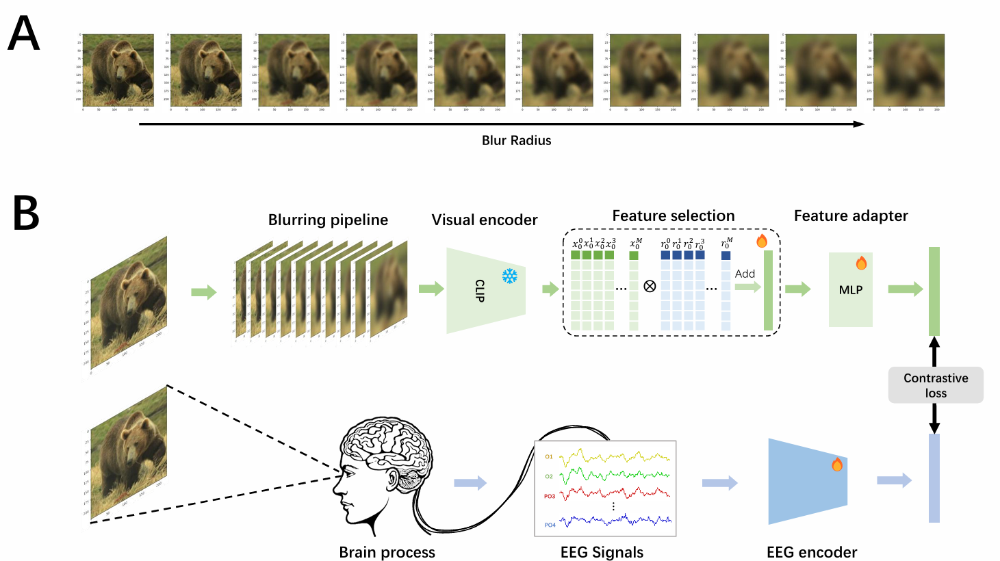

# Visual_EEG_Decoding

Leveraging Visual Blur Perception Characteristics for EEG Decoding [AAAI 2026]

## Introduction

This is the official implementation for Leveraging Visual Blur Perception Characteristics for EEG Decoding [AAAI 2026].

In this paper, we propose a novel visual decoding framework inspired by human perceptual blurring, achieving a top-1 accuracy of 80% and a top-5 accuracy of 96.9%, surpassing previous state-of-the-art methods by margins of 29.1% and 17.2%, respectively. These findings highlight the potential of incorporating perceptual properties into EEG-based visual decoding.

## **Future Plans**

More code update in progress...
