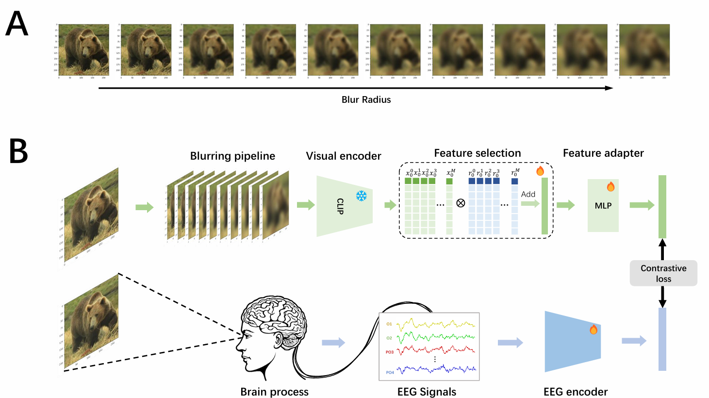

# Visual_EEG_Decoding

Leveraging Visual Blur Perception Characteristics for EEG Decoding [AAAI 2026]

## Introduction

This is the official implementation for Leveraging Visual Blur Perception Characteristics for EEG Decoding [AAAI 2026].

In this paper, we propose a novel visual decoding framework inspired by human perceptual blurring, achieving a top-1 accuracy of 80% and a top-5 accuracy of 96.9%, surpassing previous state-of-the-art methods by margins of 29.1% and 17.2%, respectively. These findings highlight the potential of incorporating perceptual properties into EEG-based visual decoding.



## How to Use

### 1. Data Preparation

Download the Things-image from the [OSF repository](https://osf.io/jum2f/files/osfstorage), Things-EEG from the [OSF repository](https://osf.io/b83fj/overview). We also provide the processed Things-EEG data and the pretrained CLIP model weights on [Quark Netdisk](https://pan.quark.cn/s/3fe3136bfafb).

If you download the processed data directly, you can skip the following processing steps.

Arrange the raw data as follows:

```
data
└── things_eeg
    ├── Image_set
    │   ├── train_images
    │   └── test_images
    └── Raw_eeg
        ├── sub-01
        ├── ...
        └── sub-10
```

### 2. EEG Data Processing

```bash
# Set subject number 'sub' from 1 to 10 to process each subject's EEG data.
python preprocess/process_eeg.py --subject sub
```

### 3. Image Data Processing

```bash
# Generate multi-blur CLIP features.
python preprocess/process_image.py
```

After the above steps, the directory structure will be:

```
data
└── things_eeg
    ├── Image_set
    │   ├── train_images
    │   └── test_images
    ├── Image_feature
    │   ├── MultiBlur_RN50_train.pt
    │   ├── MultiBlur_RN50_test.pt
    │   ├── MultiBlur_ViT-H-14_train.pt
    │   └── MultiBlur_ViT-H-14_test.pt
    └── Preprocessed_data
        ├── sub-01
        ├── ...
        └── sub-10
```

### 4. Run Training

**Intra-subject:**

```bash
python main_eeg.py
```

**Inter-subject:**

```bash
python main_eeg.py --cross_subject True
```

## Experimental Results on Things-EEG

> **Note:** The results reported in our AAAI 2026 paper were obtained using **CLIP RN50** as the vision encoder. Here we supplement additional experimental results using **CLIP ViT-H-14** on the Things-EEG dataset under the same conditions for direct comparison. We report two types of metrics: results selected by the validation set (reflecting practical performance) and the best results on the test set (reflecting the upper bound).

We provide zero-shot retrieval results using **MultiBlur ViT-H-14** as the vision encoder under two settings:
- **Intra-subject**: train and test on the same subject.
- **Inter-subject**: leave one subject out for test.

The processed MultiBlur ViT-H-14 image features have been added to the [Quark Netdisk](https://pan.quark.cn/s/3fe3136bfafb#/list/share/6fc9fd948c73468ca960a9f59604e432) for download.

> **For fair comparison:** When comparing with our method, please ensure the same model selection strategy is used.

**Selected by validation set:**

**Intra-subject:**

| Metric | sub-01 | sub-02 | sub-03 | sub-04 | sub-05 | sub-06 | sub-07 | sub-08 | sub-09 | sub-10 | **Avg** |
|:------:|:------:|:------:|:------:|:------:|:------:|:------:|:------:|:------:|:------:|:------:|:-------:|
| Top-1 Acc | 0.655 | 0.640 | 0.640 | 0.705 | 0.585 | 0.680 | 0.555 | 0.710 | 0.640 | 0.710 | **0.652** |
| Top-3 Acc | 0.880 | 0.855 | 0.875 | 0.910 | 0.805 | 0.865 | 0.805 | 0.900 | 0.865 | 0.930 | **0.869** |
| Top-5 Acc | 0.925 | 0.895 | 0.915 | 0.950 | 0.870 | 0.905 | 0.880 | 0.950 | 0.930 | 0.960 | **0.918** |

**Inter-subject:**

| Metric | sub-01 | sub-02 | sub-03 | sub-04 | sub-05 | sub-06 | sub-07 | sub-08 | sub-09 | sub-10 | **Avg** |
|:------:|:------:|:------:|:------:|:------:|:------:|:------:|:------:|:------:|:------:|:------:|:-------:|
| Top-1 Acc | 0.210 | 0.250 | 0.150 | 0.160 | 0.165 | 0.125 | 0.180 | 0.170 | 0.130 | 0.290 | **0.183** |
| Top-3 Acc | 0.385 | 0.430 | 0.265 | 0.325 | 0.320 | 0.295 | 0.305 | 0.290 | 0.275 | 0.520 | **0.341** |
| Top-5 Acc | 0.505 | 0.535 | 0.350 | 0.410 | 0.425 | 0.385 | 0.380 | 0.405 | 0.355 | 0.630 | **0.438** |

**Best metrics (historical best across epochs):**

**Intra-subject:**

| Metric | sub-01 | sub-02 | sub-03 | sub-04 | sub-05 | sub-06 | sub-07 | sub-08 | sub-09 | sub-10 | **Avg** |
|:------:|:------:|:------:|:------:|:------:|:------:|:------:|:------:|:------:|:------:|:------:|:-------:|
| Top-1 Acc | 0.685 | 0.655 | 0.695 | 0.725 | 0.625 | 0.705 | 0.620 | 0.765 | 0.700 | 0.765 | **0.694** |
| Top-3 Acc | 0.865 | 0.830 | 0.850 | 0.870 | 0.790 | 0.860 | 0.840 | 0.925 | 0.870 | 0.925 | **0.863** |
| Top-5 Acc | 0.910 | 0.895 | 0.910 | 0.930 | 0.855 | 0.910 | 0.885 | 0.940 | 0.915 | 0.965 | **0.911** |

**Inter-subject:**

| Metric | sub-01 | sub-02 | sub-03 | sub-04 | sub-05 | sub-06 | sub-07 | sub-08 | sub-09 | sub-10 | **Avg** |
|:------:|:------:|:------:|:------:|:------:|:------:|:------:|:------:|:------:|:------:|:------:|:-------:|
| Top-1 Acc | 0.255 | 0.325 | 0.180 | 0.205 | 0.190 | 0.150 | 0.200 | 0.190 | 0.205 | 0.325 | **0.223** |
| Top-3 Acc | 0.420 | 0.465 | 0.290 | 0.410 | 0.355 | 0.265 | 0.320 | 0.320 | 0.345 | 0.530 | **0.372** |
| Top-5 Acc | 0.495 | 0.570 | 0.350 | 0.510 | 0.470 | 0.365 | 0.455 | 0.425 | 0.430 | 0.665 | **0.473** |

## Citation

```bibtex
@inproceedings{liu2026leveraging,
  title={Leveraging Visual Blur Perception Characteristics for EEG Decoding},
  author={Liu, Wenchao and Li, Hongwei and Xu, Zhouyang and Ma, Lin and Li, Haifeng},
  booktitle={Proceedings of the AAAI Conference on Artificial Intelligence},
  volume={40},
  number={21},
  pages={17580--17588},
  year={2026}
}
```

If you find this work useful, please consider citing our paper and giving this repository a ⭐!

## Acknowledgement

We extend our gratitude to the prior works [UBP](https://github.com/HaitaoWuTJU/Uncertainty-aware-Blur-Prior/tree/main) and [NICE-EEG](https://github.com/eeyhsong/NICE-EEG) for their pioneering contributions to this field.


